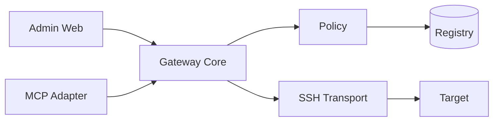

# AGENTS.md — operational contract for AI/automation

Read this file before changing MCP-Pi runtime, security, deployment, persistent state or CURRENT documentation.

## Purpose

MCP-Pi is a small security gateway between authorized AI/MCP clients and private Targets. The Gateway authenticates, authorizes, limits, delegates and audits; Targets perform the heavy work.

Current software contract:

```text
Gateway: 1.3.4
Core API: 1
Bridge API: 1
Tool catalog: v3 / 21 tools
Registry schema: 1
MCP: 2026-07-28
```

The current immutable release tag is `v1.3.4`. `main` is the stable release branch and `develop` remains the integration branch.

## Non-negotiable principles

1. **KISS** — solve the real requirement with the smallest maintainable mechanism.
2. **Reuse first** — standard/proven system facilities before custom infrastructure.
3. **Least privilege** — runtime stays unprivileged; administrative mutation is explicit.
4. **Deny by default** — absence of an explicit grant means deny.
5. **Fail closed** — ambiguous identity/policy/compatibility/audit state stops the operation.
6. **Evidence before PASS** — process existence is not acceptance.
7. **Small changes** — change one coherent layer, test it, then continue.
8. **Rollback first** — do not remove the known-good recovery path before acceptance.
9. **No public exposure by default** — Admin/MCP are private-network/loopback-first.
10. **No heavy platform for its own sake** — no Docker/proxy/monitoring stack unless a measured requirement justifies it.

## One Core

Admin Web and MCP adapter use the same Gateway Core and Registry.



Do not add a direct Admin→SSH or Adapter→SSH bypass.

## Authorization model

A normal operation is constrained by client identity, grant/capability, Target, Project, global switches and tool-specific checks.

### Structured filesystem mutations

`write_file`, `append_file`, `delete_file`, `copy_file`, `move_file` and `mkdir` require:

- `gateway_enabled=true`;
- `writes_enabled=true`;
- enabled Target and Project;
- explicit client authorization;
- Project write permission;
- canonical remote path resolution under the Project root;
- audit availability for critical mutation.

### Trusted Target shell

There is **no unrestricted or anonymous MCP shell**. `run_command` is a trusted Target-shell capability and requires:

- authenticated/registered client;
- explicit `target_shell` / compatible grant;
- `gateway_enabled=true`;
- `shell_enabled=true`;
- enabled Target and Project authorization scope;
- audit.

The Project supplies authorization scope and initial cwd. **It is not a filesystem sandbox for shell effects.** Do not document it as one.

Fresh Registry defaults are:

```text
gateway_enabled=true
writes_enabled=false
shell_enabled=false
```

Existing production values are persistent local state and may intentionally differ.

## SSH identity

Target identity is:

```text
Target ID + pinned SSH host fingerprint
```

IP/port are mutable endpoints. Never use:

```text
StrictHostKeyChecking=no
StrictHostKeyChecking=accept-new
```

as a production shortcut.

## Appliance/runtime boundaries

Normal layout:

```text
/home/mcp-gateway/mcp-gateway/                  application
/home/mcp-gateway/.local/share/mcp-gateway/    Registry/backups
/home/mcp-gateway/.config/mcp-gateway/          local config/secrets
```

Application updates must preserve persistent data/config/secrets.

The service user `mcp-gateway` must not gain general sudo. Binding TCP/80 may use only `CAP_NET_BIND_SERVICE` in the Admin unit.

A separate Pi-hole/DNS appliance is outside project scope. Never modify it as part of MCP-Pi work.

## Installation versus deployment

There are exactly two active application entrypoints:

```text
User install/reinstall/update:
  install.sh

Maintainer exact-commit promotion:
  scripts/run-resumable.sh start --expect-marker DEPLOYMENT_VERIFIED <job> -- scripts/deploy-pi.sh <exact-sha>
```

Release bundles are built with:

```text
scripts/build-release-package.sh <exact-sha>
```

Legacy deploy scripts live under `scripts/archive/` and are historical evidence, not valid production entrypoints.

Do not create another installer/deployer unless the existing contract fundamentally cannot satisfy a demonstrated requirement.

## Release/update requirements

For maintainer exact-commit deployment:

```text
clean worktree
+ HEAD == origin/<branch> == requested SHA
+ local gates PASS
+ CI PASS
+ candidate validation
+ rollback available
+ production acceptance
+ verified provenance
```

The constrained appliance must not run heavy development suites. Build/test on a development host; run lightweight Doctor/endpoints/production smoke on the appliance.

Long maintainer jobs that could outlive an MCP/ChatGPT tool window should use `scripts/run-resumable.sh`. Any operation that may restart `mcp-gateway-mcp` or `mcp-gateway-tunnel` **must** use it; `deploy-pi.sh` fails closed outside the runner unless `MCP_DEPLOY_ALLOW_DIRECT=1` is explicitly set for break-glass recovery. On reconnect, inspect `status` + `log` + real runtime state before taking any action. `CONTROL_PLANE_RESTART=EXPECTED` / `CONTROL_PLANE_RESTORED` delimit the intentional outage. Never infer failure from a lost tool response and never auto-retry a deployment. Job state is durable under `~/.local/state/local-minimcp/jobs/`; command arguments/secrets must not be persisted there.

Never move/retag/force-push historical release tags.

## Documentation contract

Documentation is classified as:

```text
CURRENT   -> authoritative user/operator behavior
REFERENCE -> deep technical detail, not primary instructions
ARCHIVE   -> historical evidence; old facts may be intentional
RELEASES  -> immutable version history
```

`README.md`, this file, `docs/README.md` and CURRENT docs must describe the implemented behavior, not an aspiration.

After behavior changes:

1. update only affected CURRENT docs;
2. preserve historical text rather than rewriting history;
3. run `python scripts/audit-docs.py`;
4. fix semantic drift, not merely broken links.

Do not turn `AGENTS.md` into a phase log or changelog. Dynamic runtime/release status belongs in `docs/project-state.md`; history belongs in Git/releases/archive.

## Change workflow

Use this sequence for significant work:

```text
OBSERVE
→ PLAN
→ CHANGE MINIMALLY
→ TARGETED TEST
→ FULL APPLICABLE GATES
→ COMMIT
→ PUSH
→ CI
→ DEPLOY/INSTALL ACCEPTANCE
→ VERIFY
→ CLEANUP
```

A failed test is input to the next diagnose/fix cycle, not a reason to lower the gate.

## Required gates

Choose gates based on changed layers. For a release candidate, the baseline is:

```bash
python -m unittest discover -s tests -p 'test_*.py' -v
cd mcp-adapter && go test ./...
cd ..
node tests/test_app_js.mjs
cd tailwind && npm run build
cd ..
python scripts/audit-docs.py
git diff --check
```

For adapter changes, build ARMv6. For installer/release UX, validate `install.sh --check` and the release bundle. For production deployment, validate services/endpoints/Doctor/Target/provenance.

## STOP conditions

Stop mutation and preserve evidence if any of these occur:

- unexpected SSH host fingerprint;
- corrupted Registry or incompatible schema;
- secret/private key enters Git;
- unexpected public listener;
- runtime suddenly requires general sudo;
- rollback path would be destroyed;
- deployment/runtime identity becomes ambiguous;
- security control would need to be disabled merely to make a gate pass.

An ordinary test failure is not a STOP condition when it can be safely diagnosed and corrected.

## Reboots

A reboot is not a generic repair action. Use service-level recovery first. Reboot only when required by the task and explicitly authorized by the user.

## Source-of-truth order

For current behavior:

```text
observed runtime / executable code contracts
→ CURRENT documentation
→ REFERENCE material
→ ARCHIVE / historical evidence
```

If runtime and docs disagree, determine which source drifted. Never mutate a healthy runtime solely to satisfy obsolete documentation.

## Final rule

Never report `PASS`, `release-ready` or `production verified` from inference. Every applicable gate must have directly observed evidence.
