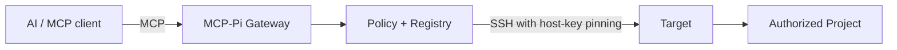
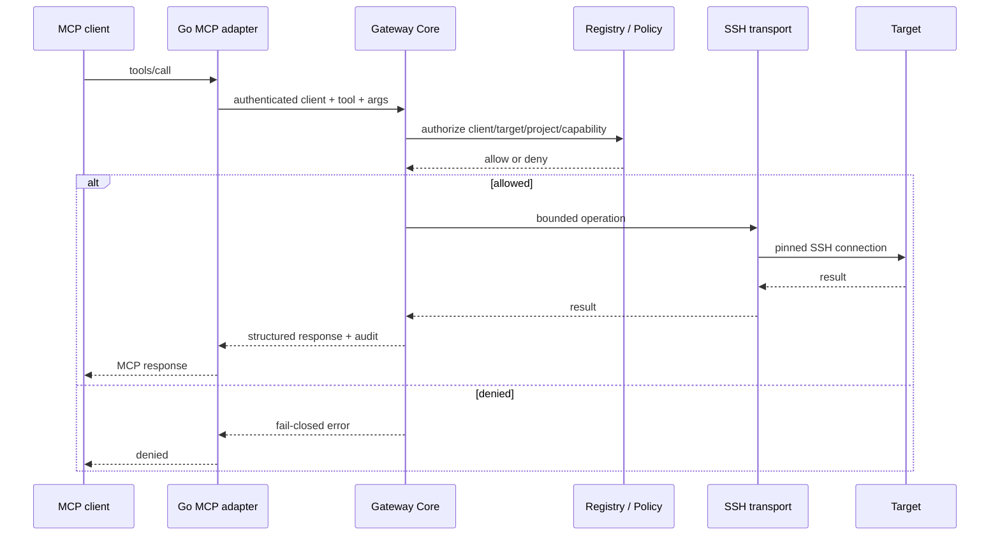

# MCP-Pi Gateway

MCP-Pi turns a small Linux appliance such as a Raspberry Pi into a **private MCP security gateway** between AI clients and machines on your own network.

The Gateway does not run an LLM and does not perform heavy work. It authenticates, authorizes, limits, delegates and audits operations on configured Targets.



## Current baseline

| Contract | Value |
| --- | --- |
| Gateway | **1.3.6** |
| Core API | 1 |
| Bridge API | 1 |
| Tool catalog | v4 / 21 tools |
| Registry schema | 4 |
| MCP protocol | `2026-07-28` |
| Python | 3.9+ |

`main` is the stable release branch and `develop` remains the integration branch. The current published release is `v1.3.6`.

## Why this exists

MCP-Pi provides a small, auditable boundary instead of giving every AI client direct shell or filesystem access.

Core rules:

- **KISS / reuse first**;
- **deny by default** and **fail closed**;
- one Gateway Core for Admin and MCP;
- explicit clients, grants, Targets and Projects;
- canonical-path checks for structured filesystem mutations;
- SSH host-key pinning (`StrictHostKeyChecking=yes`);
- structured tools before shell;
- trusted Target shell only with explicit authorization and its own kill switch;
- Target OS privilege is a separate, explicit `target_admin` capability plus per-Target consent policy;
- secrets and persistent Registry data stay outside Git;
- no Docker, proxy or monitoring stack is required for the normal appliance.

## Install

For an appliance, prefer the **official release bundle** because it includes the prebuilt ARMv6 adapter and does not require Go on the Raspberry Pi.

```bash
# after extracting the release bundle
sudo ./install.sh --check
sudo ./install.sh
```

Then configure the Admin password:

```bash
sudo -u mcp-gateway mcp-gateway setup
```

Open the Admin Console using the appliance IP shown by your network, sign in, then add the first Target, Project and AI client. Manage that client's permissions from **AI Clients → Grants** and use **Check Effective Access** to verify the real policy decision.

A source checkout also supports `./install.sh --check`; if no prebuilt adapter is present it can build one only when Go is already installed. Development builds should happen on a workstation/Termux rather than forcing a constrained ARMv6 appliance to compile Go.

Full beginner guide: **[docs/getting-started.md](docs/getting-started.md)**
Installation details: **[docs/installation.md](docs/installation.md)**

## Normal operation

```bash
sudo -u mcp-gateway mcp-gateway status
sudo -u mcp-gateway mcp-gateway doctor
sudo -u mcp-gateway mcp-gateway backup
sudo -u mcp-gateway mcp-gateway maintenance
```

Fresh Registry security defaults are:

```text
gateway_enabled = true
writes_enabled  = false
shell_enabled   = false
```

The Admin Console can enable capabilities deliberately after clients/grants and project boundaries are configured.

## Update and rollback

User-facing update and maintainer deployment are intentionally different:

```text
User install/update  -> official release bundle -> sudo ./install.sh
User rollback        -> sudo /home/mcp-gateway/mcp-gateway/install.sh --rollback
Maintainer deploy    -> run-resumable.sh -> scripts/deploy-pi.sh <exact-sha>
```

See **[docs/update-rollback.md](docs/update-rollback.md)**.

## Architecture



Technical architecture: **[docs/architecture.md](docs/architecture.md)**
Security model: **[docs/security.md](docs/security.md)**

## Documentation map

| Need | Start here |
| --- | --- |
| First installation | [Getting started](docs/getting-started.md) |
| Install details | [Installation](docs/installation.md) |
| Configure runtime | [Configuration](docs/configuration.md) |
| Daily administration | [Operations](docs/operations.md) |
| Update / rollback | [Update & rollback](docs/update-rollback.md) |
| Backup / recovery | [Recovery](docs/recovery.md) |
| Problems | [Troubleshooting](docs/troubleshooting.md) |
| Architecture | [Architecture](docs/architecture.md) |
| Security | [Security](docs/security.md) |
| Version contracts | [Compatibility](docs/reference/compatibility.md) |
| Maintainer workflow | [CONTRIBUTING.md](CONTRIBUTING.md) |
| AI-agent contract | [AGENTS.md](AGENTS.md) |
| Historical evidence | [docs/archive/](docs/archive/) and [docs/releases/](docs/releases/) |

The complete documentation classification is in **[docs/README.md](docs/README.md)**.

## Development

Heavy tests/builds belong on a development machine, not on the constrained appliance.

```bash
python -m unittest discover -s tests -p 'test_*.py' -v
cd mcp-adapter && go test ./...
cd ..
node tests/test_app_js.mjs
cd tailwind && npm run build
cd ..
python scripts/audit-docs.py
git diff --check
```

Maintainer exact-commit deployment is documented in `CONTRIBUTING.md`; it is not the beginner installation path.

## Project status

The current operational state lives in [docs/project-state.md](docs/project-state.md). Historical release notes remain immutable under [docs/releases/](docs/releases/).

MCP-Pi is intentionally small: new dependencies or abstractions need a concrete operational reason and must preserve least privilege, rollback and auditability.
