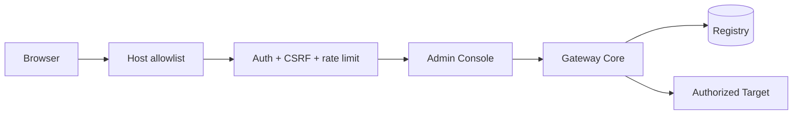

# Admin Console

The Admin Console is the human configuration surface for Targets, Projects, AI clients, grants, activity, health and kill switches. It uses the same Gateway Core/Registry as MCP.

## Access

After installation, use the appliance address permitted by its private `admin.env`, for example:

```text
http://<gateway-ip>/
```

The versioned unit itself defaults to loopback. LAN exposure is a machine-local choice written outside Git.



## First login

Bootstrap an Admin account with:

```bash
sudo -u mcp-gateway mcp-gateway setup
```

`setup` intentionally does not duplicate all Admin forms in the CLI. After Admin authentication, create Targets, Projects, clients and grants in the web UI.

## Sections

- **Dashboard** — operational summary and recent activity.
- **Targets** — endpoint/platform/SSH identity, connectivity, and Target privilege policy/approval state.
- **Projects** — authorized roots and read/write policy.
- **Clients** — AI client identities, effective capabilities and per-client Grant management.
  - **Grants** — list, create, edit, enable/disable and delete Target/Project capability grants.
  - **Check Effective Access** — evaluate a selected tool through the real `authorize_client()` Policy Engine before relying on a grant.
- **Activity** — server-side audit filtering by actor, action, Target, Project, result and UTC time range.
- **System** — runtime/hardware information.
- **Settings** — limits and kill switches.
- **Maintenance** — Doctor, backup and safe maintenance actions.


## Administrative tables

Targets, Projects, AI Clients and Client Grants share one lightweight progressive-enhancement pattern. Column headings support ascending, descending and original-order sorting, and a local search box filters the rows already rendered on that page. The underlying Registry queries also define a deterministic default order.

The Target project count links directly to Projects with that Target filter applied. Activity is intentionally different: its dataset is unbounded, so filtering and pagination stay server-side rather than loading the complete audit log into the browser. On page 1, LIVE mode is an explicit URL state and reuses the vendored HTMX runtime for three-second polling. The refreshed region uses a no-scroll swap so polling does not move the operator's viewport; Pause LIVE returns to the normal static page.

## Client grants

Open **AI Clients → Grants** for a client. Each grant reuses the existing Registry model:

```text
Client → Target → Project → Capability → Enabled
```

Prefer the narrowest scope that meets the need. The form presents ordinary capabilities separately from Target shell and Target admin privileges while preserving the existing Registry representation internally. The wildcard means all compatible ordinary capabilities and never implies Target admin. The grant list marks wildcard/admin grants and provides a High impact only view. `*` is supported for compatibility and deliberate broad access, but a fully global wildcard grant or a global `target_admin` grant requires explicit confirmation in the UI. The page supports create/edit/enable/disable/delete without direct SQLite access.

**Check Effective Access** calls the same `authorize_client()` function used by MCP discovery/execution, so results include grants plus client/Target/Project state and global kill switches. It does not maintain a parallel permission model.

## Target privilege policy

Open **Targets → Edit Target → Administrative Privileges** to choose the consent policy for elevated Target operations. The UI shows observed current/maximum privilege, backend readiness and cached approval state; it does not infer readiness only from the configured policy.

- **Never allow** is the safe default.
- **Ask before every privileged request** stores a short-lived, one-use approval for the selected client/project scope.
- **Ask once per Target boot** binds a client/project-scoped approval to the probed boot identity and fails closed if that identity cannot be obtained.
- **Always allow** removes future approval prompts only after a separate warning page, exact Target-ID confirmation and Admin-password re-authentication. Entering this flow does not save unrelated Target edits; save those separately first. It does not bypass client grants or global/Target/Project gates.

The client must still hold trusted shell access and an explicit `target_admin` capability for the same Target/Project. Existing `*` grants do not silently acquire Target system privilege after upgrade.

For Linux/Windows Targets, **Privileged SSH User** may optionally configure a separate administrative login such as `root` or `Administrator`. The normal Target user remains unchanged for standard operations. MCP-Pi reuses the same pinned host and Gateway SSH key, probes the alternate login, and marks the backend ready only if it observes real root/Administrator privilege. Merely entering an account name does not enable elevation, and Windows UAC or generic `sudo` prompts are not bypassed. Android/Termux continues to use its verified Shizuku/`rish` backend when available.

Changing the privilege authorization context invalidates cached approvals: operational Target settings, the scoped Project, client enabled state and Grants all revoke affected approvals. Cosmetic labels do not. Approvals are temporary operational state persisted only so their defined client/project scope can survive a Gateway restart; `ask_always` approvals additionally expire after a short window. They are not included in sanitized configuration exports. Schema-v1 Targets migrate with `privilege_policy=never`, so an SSH transport that is already root/Administrator intentionally stops privileged `run_command`/`run_task` execution until an administrator explicitly selects a policy and grants `target_admin`.

For arbitrary `run_command` access, MCP-Pi also treats the normal SSH account as privilege-capable when it exposes a detectable independent elevator such as Termux `rish`, Windows `sudo` or working non-interactive Linux `sudo`. The command still starts under the normal SSH user, but the same `target_admin` + policy/approval gate is required because filtering shell strings cannot safely prevent an indirect elevation.

## Security

- local password hashes;
- login rate limiting;
- CSRF on state changes;
- explicit Host allowlist;
- strict security headers/CSP;
- local vendored frontend assets;
- `HttpOnly` and `SameSite=Strict` session cookies;
- SQL parameterization;
- `mcp-gateway` service user;
- only `CAP_NET_BIND_SERVICE` for TCP/80 when needed.

`gateway_enabled`, `writes_enabled` and `shell_enabled` are independent operational switches. Security-expanding Admin changes require a durable audit attempt before mutation. Defensive actions such as disabling global writes/shell, disabling a Project/Target/client or revoking access remain available when the audit sink is degraded so an audit outage cannot prevent containment.

See [security.md](security.md).

## Frontend development

Node.js is needed only to rebuild/test frontend assets on a development host:

```bash
node tests/test_app_js.mjs
cd tailwind && npm run build
```

Production receives compiled assets and does not need Node.js.
