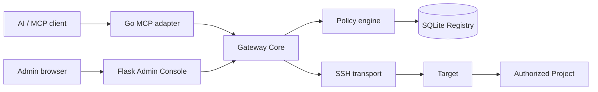
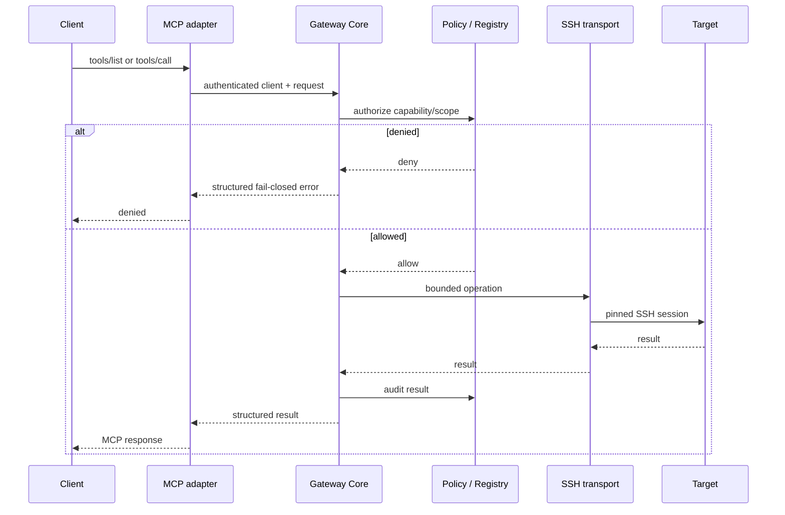
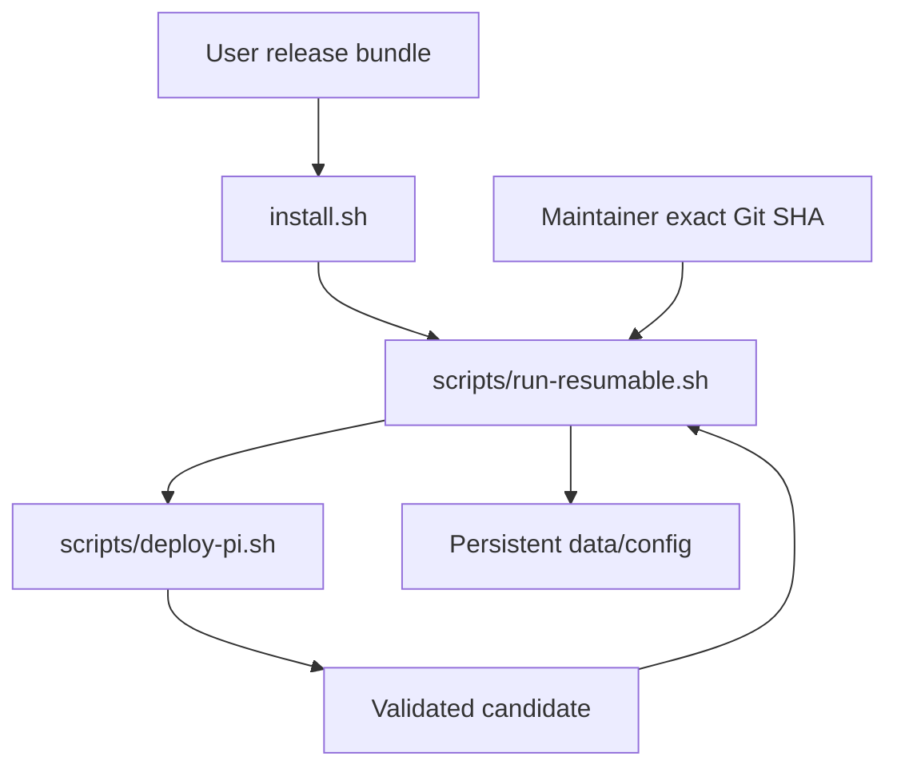

# Architecture

MCP-Pi is a small security gateway, not a compute platform. The appliance centralizes identity, policy, audit and protocol adaptation; Targets perform the actual work.

## Components



The Admin Console and MCP adapter **must use the same Gateway Core**. There is no parallel Admin-to-SSH bypass.

## Responsibilities

| Component | Responsibility |
| --- | --- |
| Go MCP adapter | MCP protocol, HTTP/stdin transport, client identity handoff, tool annotations |
| Gateway Core | canonical tool behavior, limits, audit and orchestration |
| Policy | client/grant/Target/Project/capability authorization plus Target privilege consent |
| Registry | Targets, Projects, clients, grants, privilege approvals, settings and activity |
| SSH transport | pinned Target connection and bounded remote operations |
| Admin Console | human configuration using the same Registry/Core |
| Target | performs project work; not trusted merely because its IP matches |

## Request flow



## Tool families

The catalog currently contains 21 deterministic tools. They fall into four practical groups:

- read/introspection;
- structured project filesystem mutations;
- allowlisted project tasks;
- appliance administration plus trusted Target shell.

Structured filesystem mutations enforce Project-root canonical paths. `run_command` is different: it is a **trusted Target shell** for explicitly authorized clients. Its Project identifies authorization scope and initial working directory; it is not a filesystem sandbox.

### Privileged Target execution

Privilege elevation extends the existing execution path; MCP-Pi does not expose a second administrative shell. `run_command` carries `privilege=standard|required`. Normal authorization is evaluated first. A required command, an already-elevated `run_command`, or an allowlisted `run_task` whose base transport is observed root/Administrator then crosses a second gate consisting of an explicit `target_admin` grant, Target privilege policy, optional approval/boot lease, and a verified platform backend.

```text
run_command
  -> normal target_shell authorization
  -> requested/observed privilege?
       no  -> normal transport
       yes -> explicit target_admin grant
           -> Target privilege_policy
           -> required approval/boot_id
           -> verified native backend
           -> execute + audit
```

Platform details remain behind this boundary: Shizuku/`rish`, a transport already proven root/Administrator, or an optional `privilege_user` SSH identity on Linux/Windows that is independently probed as root/Administrator on the same pinned Target. Merely finding `sudo` or Windows elevation support is not enough to mark a backend ready, because delegating arbitrary escalation would create a second privilege path outside the policy engine. A missing verified backend is a denial, not a reason to weaken the host's global security policy.

## Identity versus endpoint

A Target ID and pinned SSH host key establish identity. DHCP addresses and ports are runtime endpoints and may change.

```text
Target ID + SSH host fingerprint = identity
IP + port                         = endpoint
```

Endpoint rediscovery may update an address only after cryptographic identity matches. An unexpected host key fails closed.

## Runtime layout

```text
/home/mcp-gateway/mcp-gateway/                  application runtime
/home/mcp-gateway/.local/share/mcp-gateway/    Registry + backups
/home/mcp-gateway/.config/mcp-gateway/          private config + secrets
/etc/systemd/system/                             service definitions
```

Application updates must not overwrite persistent Registry/config/secrets.

## Installation and deployment boundaries



`install.sh` is the user install/reinstall path. `deploy-pi.sh` is a maintainer promotion mechanism with exact-commit provenance and transactional rollback.

## Resource model

The reference appliance is intentionally constrained. Heavy tests, frontend builds and Go cross-compilation run on a development host. The appliance runs only lightweight validation/Doctor and the production services.

The current Go adapter invokes the Python Core through a fresh bridge subprocess for individual tool calls. That boundary is a known performance candidate on ARMv6, but a full Go rewrite is not assumed to be beneficial until the reference appliance quantifies process-startup, in-process Core, adapter and remote-operation costs separately. See [performance.md](reference/performance.md) for the canonical measurement and migration gate.

See [security.md](security.md), [configuration.md](configuration.md) and [compatibility.md](reference/compatibility.md).
