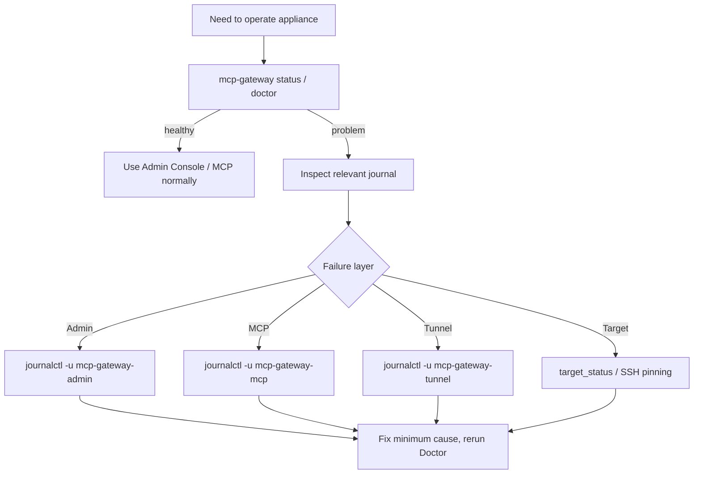

# Operations

This guide covers normal operation of an installed MCP-Pi appliance. Installation/update procedures live in separate guides so routine administration stays short.

## Quick health

```bash
sudo -u mcp-gateway mcp-gateway status
sudo -u mcp-gateway mcp-gateway doctor
```

Service-level check:

```bash
systemctl is-active mcp-gateway-admin mcp-gateway-mcp
systemctl is-active mcp-gateway-tunnel  # only when the optional tunnel is configured/enabled
```

MCP probes are loopback-only:

```bash
curl -fsS http://127.0.0.1:8090/live
curl -fsS http://127.0.0.1:8090/ready
```

## Daily model



Diagnose one layer at a time. Do not change policy, delete Registry data or disable host-key checks merely to make a symptom disappear.

## Admin Console

Open the trusted address configured in private `admin.env`. Machine-specific IPs are intentionally not part of the versioned product configuration.

Use Admin Console for:

- Targets, connectivity tests and administrative privilege policy/approvals;
- Projects and roots;
- clients/grants;
- audit activity;
- limits and kill switches;
- Doctor/maintenance actions.

## Kill switches

Fresh defaults keep writes and trusted shell disabled. An existing production instance may intentionally have different persisted values.

Before changing a switch, understand its scope:

```text
gateway_enabled -> normal Gateway operations
writes_enabled  -> structured filesystem mutations
shell_enabled   -> trusted Target shell
```

Do not conflate `writes_enabled` with `run_command`; they are deliberately independent security controls.

## Target privilege operation

Target privilege is configured under **Targets → Edit Target**. Keep `never` unless elevated Target work is intentionally delegated. For interactive policies, use the Admin Console approval action; do not create ad-hoc password files or broaden SSH/sudo configuration merely to avoid the approval step. Enabling `always_allow` is deliberately separate from ordinary Target editing and requires the exact Target ID plus Admin-password re-authentication.

A privileged command still requires `shell_enabled`, trusted shell authorization and an explicit matching `target_admin` grant. Treat `target_shell` as a trusted arbitrary shell: do not give its normal remote OS account unrestricted independent `sudo`, `rish` or equivalent escalation if the `target_admin` gate is intended to remain authoritative. For Linux/Windows, an optional **Privileged SSH User** may be configured instead; it is used only after those gates pass and must be probed as real root/Administrator on the same pinned Target. Do not disable UAC or configure general `NOPASSWD` sudo to make this work. `ask_always` approvals are single-use, short-lived and scoped to the selected client/project; `ask_once_per_boot` approvals are also scoped and become invalid after the Target boot identity changes. Cached approvals are also revoked when their authorization context changes, including operational Target settings (including the privileged SSH identity), the scoped Project, client enabled state or Grants. On Android/Termux, Shizuku-backed commands run from `/` because Android `shell` cannot traverse Termux private storage; use explicit Android-visible paths inside the command when needed.

## Backup

```bash
sudo -u mcp-gateway mcp-gateway backup
```

The backup uses SQLite's online backup API. Keep important backups off-device and encrypt private archives when leaving the appliance.

## Maintenance

```bash
sudo -u mcp-gateway mcp-gateway maintenance
```

Maintenance is intentionally conservative: Registry backup/rotation, integrity/Doctor and lightweight resource/update preview. It is not an unattended OS auto-updater.

## Logs

```bash
journalctl -u mcp-gateway-admin -n 100 --no-pager
journalctl -u mcp-gateway-mcp -n 100 --no-pager
journalctl -u mcp-gateway-tunnel -n 100 --no-pager
```

Classify deliberate service stops/restarts separately from crash loops, traceback, permission errors, bind failures or authentication failures.

## Restart order

When a restart is actually needed:

```text
Admin
→ MCP adapter (wait for /ready)
→ optional Tunnel
```

The tunnel depends on the MCP backend. Avoid restarting the whole appliance when a single service can be repaired.

## Updates

Do not update application code by copying arbitrary files into the live runtime. Use [update-rollback.md](update-rollback.md).

## Recovery

For Registry restore, lost runtime or disaster recovery use [recovery.md](recovery.md). For diagnosis use [troubleshooting.md](troubleshooting.md).
## Long maintainer jobs and tool-window disconnects

Long jobs must not depend on an interactive ChatGPT/MCP tool window staying alive. Use the resumable runner on the development Target:

```bash
JOB="deploy-${SHA:0:12}"
scripts/run-resumable.sh start \
  --expect-marker DEPLOYMENT_VERIFIED \
  "$JOB" -- scripts/deploy-pi.sh "$SHA"
```

The runner uses the tools already present on Termux (`nohup`, `setsid`, `flock`) and stores only operational state under:

```text
~/.local/state/local-minimcp/jobs/<job>/
```

It does **not** persist the command arguments in metadata. The private job log still contains the command's stdout/stderr, so commands themselves must continue to avoid printing secrets. Inspect a disconnected job before deciding what to do:

```bash
scripts/run-resumable.sh status "$JOB"
scripts/run-resumable.sh log "$JOB" 120
```

Possible states are `RUNNING`, `VERIFIED`, `FINISHED`, `FAILED` and `INTERRUPTED`. `INTERRUPTED` means the lock is gone and no exit code was recorded; it is deliberately **not** auto-retried. First inspect the log and real production state. For jobs that restart MCP/Tunnel, `CONTROL_PLANE_RESTART=EXPECTED` without a later `CONTROL_PLANE_RESTORED` means the control plane may still be unavailable or rollback may be in progress; wait for reconnection and inspect state instead of relaunching the job.

After evidence is collected and the job is no longer running:

```bash
scripts/run-resumable.sh cleanup "$JOB"
```

For a short critical operation on Android, `start --wake-lock ...` is available when Termux:API provides `termux-wake-lock`/`termux-wake-unlock`. Do not leave a wake lock permanently enabled. Device battery settings are an operator choice; if Android is killing Termux background jobs, excluding Termux from battery optimization is preferable to adding another daemon to this project.
